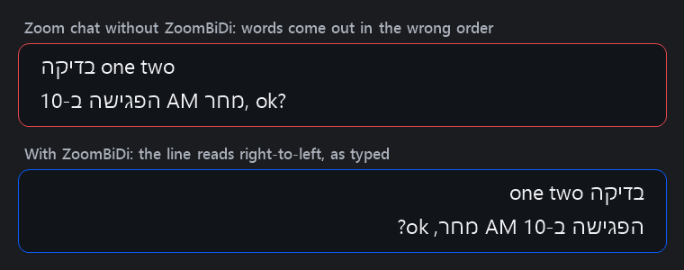

<p align="center">
  
</p>

<h1 align="center">ZoomBiDi</h1>

<p align="center"><b>Type Hebrew and English together in Zoom chat, without the text jumping around.</b></p>

<p align="center">
  <a href="https://github.com/gonenbeneish-mapcore/ZoomBiDi/releases/latest"><b>Download for Windows</b></a>
</p>

---

## What it does

When you write a Zoom chat message that mixes Hebrew and English, Zoom often treats the line as left-to-right.
Words come out in the wrong order and the cursor jumps around while you type:

<p align="center"></p>

The known workaround is to type an invisible Unicode character at the start of every line to tell Zoom which
way the line goes. ZoomBiDi does that for you automatically:

* It runs quietly in the system tray.
* Every time you start a new line in a Zoom chat box, it slips U+2068 (FIRST STRONG ISOLATE) in at the start of
  the line. That character gives the line the direction of its first letter: lines that start in Hebrew read
  right-to-left, and lines that start in English stay left-to-right (`hello שלום` stays `hello שלום`).
* A line that starts with an @mention takes its direction from the name, so `@mctester שלום` keeps the name on
  the left.
* Search boxes and other fields in Zoom aren't touched. Outside Zoom it does nothing at all.
* It's light: about 3 MB of memory while you're in other apps, about 12–17 MB while Zoom is in front, and no
  CPU at all outside Zoom. The first character of a line is held for a few milliseconds (median 6 ms); the rest
  of your typing passes straight through.
* It works with a Zoom that's already running; there's no need to restart Zoom.

You just type as usual.

## Install

1. Download from the [latest release](https://github.com/gonenbeneish-mapcore/ZoomBiDi/releases/latest):
   * **`ZoomBiDi-standalone.exe`** (about 68 MB): runs on any 64-bit Windows 10/11. Pick this one if unsure.
   * **`ZoomBiDi.exe`** (about 0.3 MB): needs the
     [.NET 8 Desktop Runtime](https://dotnet.microsoft.com/download/dotnet/8.0) (x64) or newer.
2. Put it anywhere (for example `Documents\ZoomBiDi`) and run it. There's no installer.
3. The exe isn't code-signed, so Windows SmartScreen may warn on first run: click **More info**, then **Run anyway**.
   Or, before running it, right-click the exe → **Properties** → tick **Unblock** → OK.

A blue **Aא** icon appears in the system tray (it may be under the **^** overflow arrow; you can drag it onto
the taskbar).

## Use

Just chat in Zoom. Tray icon controls:

* **Left-click**: pause / resume. Grey means paused.
* **Right-click** for the menu:
  * **Start with Windows**: launch ZoomBiDi automatically when you sign in
  * **Debug log** / **Open log**: see what it decided and why (useful if something doesn't work)
  * **Exit**

**Privacy:** ZoomBiDi never connects to the network and never stores what you type. The optional debug log (off
by default) records only the first character of each new line, and the key codes of non-character keys (Enter,
Backspace, arrows…).

---

## Technical details

### How it works

* **Hooks only while Zoom is in front.** Normally the only thing running is a cheap foreground-change
  notification (`SetWinEventHook` with `EVENT_SYSTEM_FOREGROUND`). The low-level keyboard and mouse hooks
  (`WH_KEYBOARD_LL`, `WH_MOUSE_LL`) are installed when a Zoom window comes to the front and removed when it
  leaves, so typing in other apps never passes through ZoomBiDi. Hooks run on a dedicated thread, and each key
  is translated with the focused window's keyboard layout (`ToUnicodeEx`).
* **Line starts come from the keys.** Zoom's message box doesn't expose its caret or text to UI Automation (its
  Text pattern returns only the box's label, "Message to …"), so ZoomBiDi works out where a line starts from
  what it sees typed. A line starts:
  * after Enter, Shift+Enter or Ctrl+Enter, except when the word just typed starts with `@`, or with `:` and a
    letter (then Enter picks from Zoom's mention or emoji list);
  * after the message is sent (Ctrl+Enter or Enter, whichever Zoom's box label says sends), after Ctrl+A
    (followed by typing, Delete or Backspace), or when Backspace removed the mark of the box's only line;
  * when the user arrives in a chat (click, window switch, Tab, Zoom's chat-switching keys) whose box Zoom
    reports as empty, and which hasn't been typed into since it was last sent. Zoom's accessible name for the
    box is the label followed by the draft, but only as it was when the chat was opened, so it's trusted only
    for chats ZoomBiDi hasn't seen typing in.

  Everything else (Backspace, Delete, arrows, Home/End, other shortcuts) never adds a mark.
* **Cheap by default.** Ordinary typing passes straight through. Only the first character of a line as defined
  above is held, while UI Automation confirms (on a separate MTA thread, through the COM API directly) that the
  focus is a Zoom message box: an Edit control named "Message to …", belonging to Zoom or to a child process of
  Zoom (the chat is an embedded WebView2, so the box lives in `msedgewebview2.exe`).
* **Replay in order.** The held keys are then replayed with `SendInput`, with U+2068 in front when needed.
  A typical check takes about 5 ms.
* **Mentions.** Chromium skips Zoom's mention chip when it works out a line's direction, so U+2068 in front of
  `@name שלום` would make the line right-to-left. A line that starts with `@` is therefore marked by the name's
  first letter instead: U+2066 (LEFT-TO-RIGHT ISOLATE) for English, U+2067 (RIGHT-TO-LEFT ISOLATE) for Hebrew.
  The mark goes in with the `@` as usual. When the first letter arrives, ZoomBiDi deletes the mark and the `@`
  (two Backspaces), types them again with the right mark, then the letter. That works even with a language switch
  in between.
* **Backspace over the mark.** After inserting a mark, ZoomBiDi counts the characters typed and deleted on that
  line. When a plain Backspace would delete only the invisible mark (so nothing would visibly happen), it sends
  one more Backspace: one press then joins an otherwise empty line with the line above, or empties the box.
  Counting stops at anything that may move the caret, and Backspace is then left alone.
* **Keys typed during a check.** They're held too, and each is classified as it arrives, using the modifier
  state the held keys themselves produce (so a held Ctrl+V is still seen as a shortcut). If they include a new
  line (e.g. a fast Enter and the next line's first letter), everything up to that point is replayed, and the
  next line's first character gets its own check, 40 ms later so that Zoom has processed the replayed keys.
* **Switching keyboard language.** Alt+Shift can leave Zoom's window in menu mode, where the next key would be
  swallowed by the window menu. When Windows reports menu-bar mode (and no menu is actually open), ZoomBiDi
  sends Escape before the key. Alt+Shift can also move UI Automation's focus to Zoom's menu bar for a moment:
  then the chat box from the last check is asked directly, as long as nothing could have moved the focus since.
* **Missed notifications.** A once-a-second check compares the foreground window with the last one seen, in
  case a foreground change notification was missed (e.g. while ZoomBiDi was starting).
* **Small footprint.** Calling the UI Automation COM API directly, instead of the managed
  `System.Windows.Automation` wrapper, means WPF is never loaded. ICU globalization data and background GC are
  off. When Zoom leaves the foreground, the app compacts its heap and releases its working set.
* **Never blocks.** Windows silently removes hooks that respond slowly, and the target app may need input to
  flow before it can answer UI Automation. So the hook callback never waits: results and timeouts arrive as
  messages on the hook thread. If UI Automation takes longer than `UiaTimeoutMs`, the keys are released
  unchanged.
* **Never loses keys.** An error in any handler is logged and the held keys are released unchanged, rather than
  stopping the hook thread. Keys held at exit are sent before ZoomBiDi closes. The debug log is written on a
  background thread, so the disk can never slow down typing.

### Settings

Advanced settings live in `%APPDATA%\ZoomBiDi\settings.json`. To open it, paste `%APPDATA%\ZoomBiDi` into
the Explorer address bar. Restart ZoomBiDi after editing.

| Setting | Default | Meaning |
|---|---|---|
| `Enabled` | `true` | Same as the tray toggle |
| `MarkerHex` | `2068` | Code point to insert. `2068` (FSI) follows each line's first letter. Up to 1.2 the default was `2067` (RLI, always right-to-left); settings files still holding `2067` are upgraded automatically, so write `U+2067` to keep it on purpose |
| `ProcessNames` | `["Zoom"]` | Processes (without `.exe`) treated as Zoom |
| `ChatNamePattern` | `message` | Regex matched (case-insensitive) against the focused box's accessible name |
| `UiaTimeoutMs` | `250` | Give up and type without the mark if the check takes longer |
| `DebugLog` | `false` | Write decisions to `%APPDATA%\ZoomBiDi\log.txt` |
| `ProcessInjectedInput` | `false` | Testing only: also react to synthetic keystrokes |

`--settings <path>` on the command line uses a different settings file (one instance runs per settings file).

### Project layout

| Path | What |
|---|---|
| `src/KeyboardMonitor.cs` | Hook thread: hooks only while Zoom is in front, key classification, hold/replay state machine, marker injection |
| `src/ChatInspector.cs` | UI Automation check: is the caret at the start of a line in a chat box? (retries, remembered chat box) |
| `src/UiaCom.cs` | Minimal bindings to the UI Automation COM API (verified against the Windows SDK header) |
| `src/ProcessTree.cs` | Parent/child process lookup (for Zoom's WebView2 child process) |
| `src/Bidi.cs` | Direction marks, letters and line breaks |
| `src/TrayApp.cs`, `src/Program.cs` | Tray icon, menu, startup, single instance |
| `src/Settings.cs`, `src/Logger.cs`, `src/Native.cs` | Settings file, debug log, Win32 interop |
| `tools/MakeIcon.ps1` | Generates the icons in `assets/` (and `assets/icon-preview.png`) |
| `test/` | Typing test harness and stand-in chat page |

### Build

Requires the .NET 8 SDK or newer.

```
dotnet publish ZoomBiDi.csproj -c Release -r win-x64 -o publish -p:PublishSingleFile=true -p:SelfContained=false
```

For the standalone build, use `-p:SelfContained=true -p:EnableCompressionInSingleFile=true` instead.

### Test

`test/testpage.html` is a Chromium contenteditable box labelled like Zoom's chat input. `test/TypeHarness.ps1`
types 38 cases into it (Hebrew, English and mixed lines, multiple lines, Backspace over the mark, typos fixed
mid-line, Home, arrows, selections, lines starting with a mention, Enter picking a mention, Alt taps, and "bursts"
sent in one go so that keys arrive while a check is running) and checks exactly which mark ended up where, using
an exact comparison
(culture-aware string comparison ignores invisible characters). Unlike Zoom, the test page exposes its text, so
"is the box empty" is always accurate there; the key-based line tracking is the same.

| Option | Effect |
|---|---|
| `-Mode layout` (default) | Real key presses through the Hebrew and English keyboard layouts |
| `-Mode unicode` | Injected characters, no keyboard layout involved |
| `-AltShift` | Switch keyboard language with Alt+Shift, like a person, instead of asking the window directly |
| `-DelayMs <n>` | Delay between keys (default 70; 10 = very fast typing) |
| `-Only <i,j,...>` | Run only some cases (0-based indexes) |

1. Start ZoomBiDi with a test settings file containing `"ProcessNames": ["msedge"]` and
   `"ProcessInjectedInput": true`:
   `ZoomBiDi.exe --settings test-settings.json`
2. Open `test/testpage.html` in Edge.
3. Run:

   ```
   powershell -ExecutionPolicy Bypass -Command "& .\test\TypeHarness.ps1 -Mode layout"
   ```

The harness types into the foreground window, and stops as soon as the test page loses focus, so it never types
anywhere else. The Hebrew and English (US) keyboard layouts must both be installed for `-Mode layout`.

### Known limitations

* Only typed text is handled. Pasted text doesn't get the marker.
* The caret sits at the right of a Hebrew line instead of after the last word. That's Zoom's own behaviour (it
  happens without ZoomBiDi too): Zoom's editor has no right-to-left support, and no invisible character changes
  it. 16 combinations were tested in Zoom. For the same reason ZoomBiDi doesn't right-align Hebrew lines (Zoom's
  Ctrl+Shift+R would do it, but the caret stays on the wrong side).
* Because Zoom hides its caret, a line only gets the mark where the keys show it starts (see "How it works").
  Clicking or pressing Home at the start of a line that already has text and typing there adds no mark. The same
  goes for returning to a chat whose draft you emptied with Backspace (rather than sending it or Ctrl+A).
* The chat inside a Zoom *meeting* hasn't been tested and may name its text box differently. If it's ignored
  there, the debug log shows the name, and `ChatNamePattern` can be widened.
* Enter right after a word starting with `@`, or with `:` and a letter (`:smile`), is assumed to pick a mention
  or emoji, so it doesn't start a marked line, even if no list was open.
* A mouse click within a few milliseconds of a line's first character can reach Zoom before that character.
